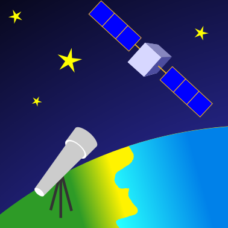

# Orbit hunter

Orbit hunter allows you to track satellites with your INDI-compatible telescope.

## Features
Orbit hunter has the following features:
- Tracking based on satellite ephemeris
- Pass prediction
- Simulation mode
- Tracking correction with GUI or external joystick

## Compatibility
Orbit hunter is compatible only with INDI drivers. It is not compatible with ASCOM.
It requires a mount that support variable tracking rate. Following mounts are compatible:

TODO: Table

Depending on the maximum speed of the mount in variable tracking mode you may have trouble to track fast and low satellites.
Joysticks are supported through the `indi_joystick` driver.

## Install
First you need to install the following Prerequisites:
- INDI library and drivers: <https://indilib.org/download.html>
- Python and pip: TODO
- Qt: TODO

Then the recommended method is to install Orbit hunter through the Python Package Index.

    TODO
  
Alternatively if you want to install Orbit hunter from the source, you will have to install following python packages first:

    TODO

## Usage
